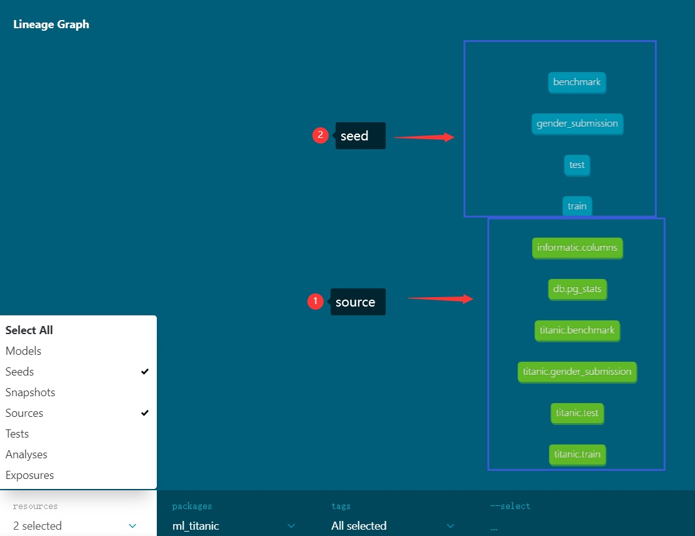
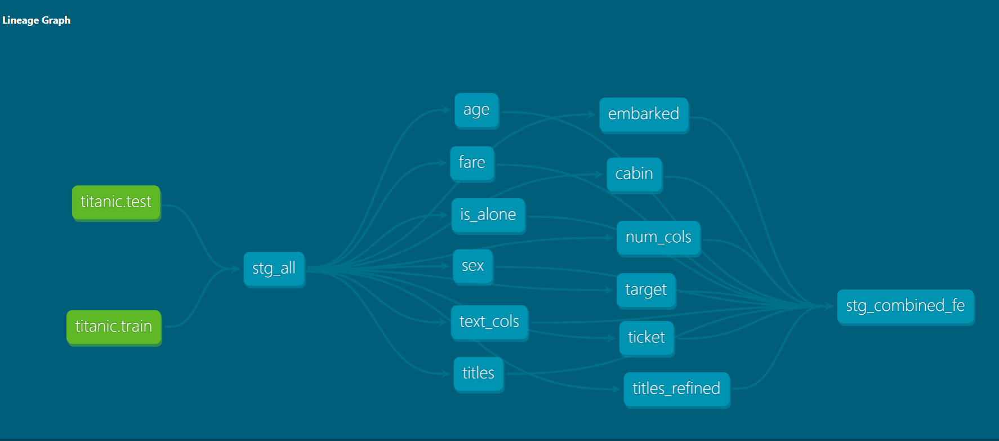
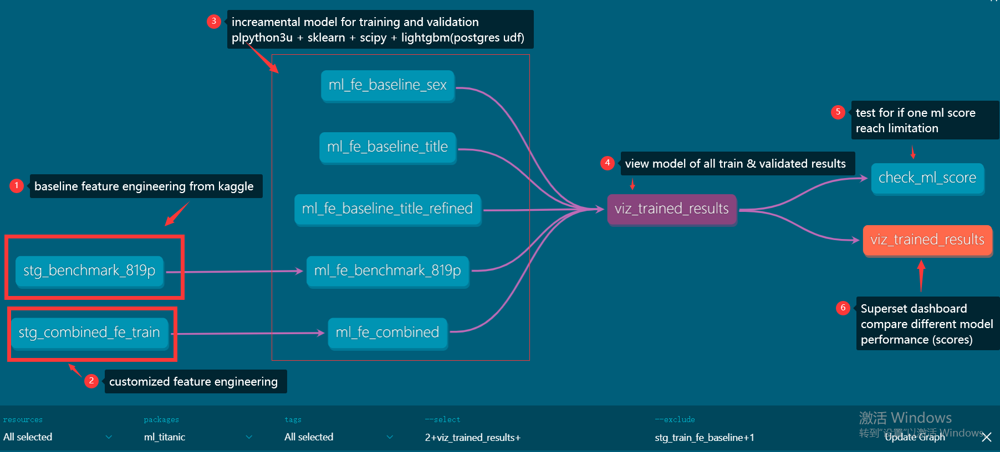
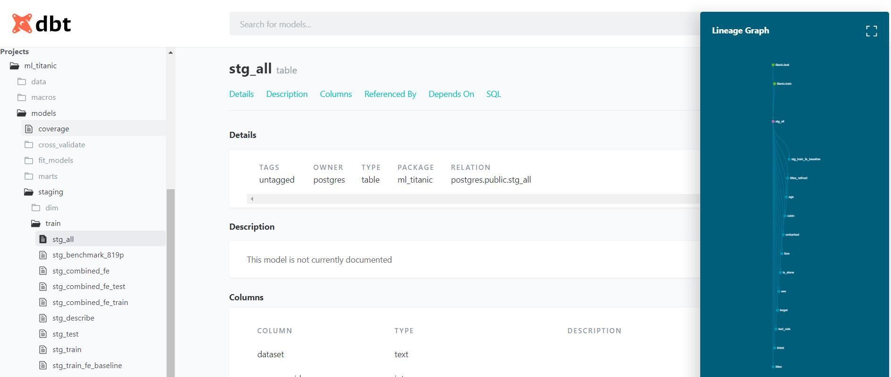

# what is pgml

there is 3 core driver in machine learning. They are data, algorithms, and computing resources. Now, the data are stored in data warehouse(Relation Database such as postgresql and oracle and etc ) or data lake(mainly hadoop hive) or cloud resource(google big query, amazone RDS/ s3 and etc).
Thought cloud service working well, if data privacy and security is your big concern. local storage and computing resource need be build. Apart from that, moving data between data warehouse/lake and computing resource remain a big bottleneck in common machine learning jobs.  Though there is madlib or other machine learning solution. There is space of solution of machine learning inside of database. 

pgml is postgresql machine learning tools. It combined the advantage of postgresql and machine learning power together by :

* install popular machine learning modules like sklearn, lightgbm, scipy, numpy, pandas and etc co-located with postgresql database(we call it as datawarehouse).

|||||

* computer the data insides of database by postgres UDF. it is write in plpython3( one server programm lanugage).

* utilizing DBT to get data module DDL/DML step easy, the data can be read inside postgresql and utilize the machine learning lib power.

 
* last but not least, all of above are built inside of docker image. It can easily move and revised at local or in the cloud.

# Getting start of pgml
Let's get pgml and get the python version by run sql inside of postgresql datawarehouse.
## requirements:

* centos/debian linux system with docker/docker-compose installed.
* windows10 system with docker desktop installed. 

## Steps:

1. git clone <the pgml git address>
2. change to the cloned folder it might be ./pgml
3. docker-compose up -d
4. docker-compose exec pgml psql -U postgres -c 'select get_python_version()' 

if every thing is smooth, the output will be 
> \# docker-compose exec pgml psql -U postgres -c 'select get_python_version()'
>
>            get_python_version
>
>            -----------------------------------------
>             3.7.3 (default, Jan 22 2021, 20:04:44) +
>
>              [GCC 8.3.0]
>
>              (1 row)

>
Congratualtion! The postgresql based machine learning datawarehouse has been ready for you using. 

# how to use the pgml tool

## By Manual (hard mode)
1. write postgresql UDF by plpython3u. Inside of UDF, you can write it like normal python script or functions. 
2. call the writed UDF in sql
3. get the result.
I used to manually mantenance the table, view and datas via using postgresql as machine learning warehouse. However, it is quite hard to change(DDL), read(DML) and test and quality control the code.

## DBT mode(easy mode)
### why DBT
In 2021, I was found there is ETL tools focused on data transformation called DBT. DBT is a data built tool which focused on data
transformation with data lineage, test, and DAG. With DBT, You can still write SQL and gain quality control, documents and team work. DBT did not need data analyst to create table/view by DDL.

Besides, you can use DBT + vscode ide. It will make life and work easy. 
VScode is a popular IDE. Both python, Sql, and DBT can work inside it. you can use python extension, dbt extension as
well as git extension.

Last but not least, Vscode can work remotely with docker-compose. 

### Preparing
1. profiles.yml. This file will define the datawarehouse connection information. 
2. dbt_project.yml. This file will connect profile.yml datawarehouse name and define the project folder position.
3. run dbt deps. It will get dbt 3rd party extension from dbt hub.
3. environment check by dbt config. If everything is OK, you can see following output:

>\#  pwd
>
	>/temp/pgml
>
>
> \# docker-compose exec dbt dbt debug
>
>
>	Configuration:
>
	>	  profiles.yml file [OK found and valid]
	>
	>	  dbt_project.yml file [OK found and valid]
>	
>	Required dependencies:
>
	>	 - git [OK found]
>	
>	Connection:
	
	>
	>	  Connection test: OK connection ok
	>	
>	[pgml]#

### Example: Kaggle Titanic case

1. Load data by run dbt seed. (put the original csv inside of project data folder. The dbt will automaticall import data into postgres datawarehouse). Below is example of load titanic train, test, kaggle benchmark csv .
>    	[ pgml]# docker-compose exec dbt dbt seed
>    	Running with dbt=0.19.1
>    	Found 40 models, 65 tests, 0 snapshots, 0 analyses, 157 macros, 2 operations, 4 seed files, 6 sources, 4 exposures
>    	08:19:18 | 2 of 4 OK loaded seed file public.gender_submission.................. [INSERT 418 in 0.46s]
>    	08:19:18 | 1 of 4 OK loaded seed file public.benchmark.......................... [INSERT 891 in 0.47s]
>    	08:19:18 | 3 of 4 OK loaded seed file public.test............................... [INSERT 418 in 0.47s]
>    	08:19:18 | 4 of 4 START seed file public.train.................................. [RUN]
>    	08:19:18 | 4 of 4 OK loaded seed file public.train.............................. [INSERT 891 in 0.21s]
>    	08:19:18 |
>    	08:19:18 | Finished running 4 seeds, 2 hooks in 0.90s.
>    
>    Completed successfully
>    
>    Done. PASS=4 WARN=0 ERROR=0 SKIP=0 TOTAL=4
seed imported and source generated.

   
2. feature engineering. Data Analysis can do feature engineering by write sql file. the file name will be stored in database warehouse as table or views based on the yml configurationi.  If the sql statement 'select * from module ' is write as  'select * from {{ref('module')}}, the dbt will automatically find the data lineage. know the data source and data destination. After finishing featuring engineering, you can run dbt run as folow to compile and execute these modules. The modoule will be created in postgresql database and the data will be created /or incrementally created. here is example:
   
>	[pgml]# docker-compose exec dbt dbt run
>	
>	Running with dbt=0.19.1
>	
>	Found 40 models, 65 tests, 0 snapshots, 0 analyses, 339 macros, 2 operations, 4 seed files, 6 sources, 4 exposures
>	
>	08:39:21 |
>	
>	08:39:21 | Running 2 on-run-start hooks
>	
>	08:39:21 | 1 of 2 START hook: ml_titanic.on-run-start.0......................... [RUN]
>	
>	08:39:21 | 1 of 2 OK hook: ml_titanic.on-run-start.0............................ [DO in 0.00s]
>	
>	08:39:21 | 2 of 2 START hook: ml_titanic.on-run-start.1......................... [RUN]
>	
>	08:39:21 | 2 of 2 OK hook: ml_titanic.on-run-start.1............................ [CREATE FUNCTION in 0.02s]
>	
>	08:39:21 | Concurrency: 3 threads (target='dev')
>	
>	08:39:21 |
>	
>	08:39:21 | 1 of 40 START table model public.stg_all............................. [RUN]
>	
>	08:39:21 | 2 of 40 START table model public.stg_benchmark_819p.................. [RUN]
>	
>	08:39:21 | 3 of 40 START table model public.stg_train........................... [RUN]
>	
>	08:39:22 | 1 of 40 OK created table model public.stg_all........................ [SELECT 1309 in 0.28s]
>	
>	08:39:22 | 4 of 40 START table model public.stg_train_test...................... [RUN]
>	
>	08:39:22 | 2 of 40 OK created table model public.stg_benchmark_819p............. [SELECT 891 in 0.28s]
>	
>	08:39:22 | 3 of 40 OK created table model public.stg_train...................... [SELECT 891 in 0.29s]
>	
>	08:39:24 | 31 of 40 OK created table model public.stg_combined_fe............... [SELECT 1309 in 0.14s]
>	
>	08:39:24 | 33 of 40 START incremental model public_models.ml_fe_baseline_title_refined [RUN]
>	
>	08:39:25 | 28 of 40 OK created incremental model public_models.ml_fe_baseline... [INSERT 0 2 in 1.80s]
>	
>	08:39:26 | 32 of 40 OK created incremental model public_models.ml_fe_baseline_sex [INSERT 0 2 in 1.72s]
>	
>	08:39:26 | 35 of 40 START table model public.stg_combined_fe_train.............. [RUN]
>	
>	08:39:26 | 35 of 40 OK created table model public.stg_combined_fe_train......... [SELECT 891 in 0.08s]
>	
>	08:39:26 | 36 of 40 START view model public_superset.get_corr................... [RUN]
>	
>	08:39:26 | 33 of 40 OK created incremental model public_models.ml_fe_baseline_title_refined [INSERT 0 2 in 1.74s]
>	
>	08:39:26 | 37 of 40 START table model public.stg_combined_fe_test............... [RUN]
>	
>	08:39:26 | 36 of 40 OK created view model public_superset.get_corr.............. [CREATE VIEW in 0.12s]
>	
>	08:39:26 | 38 of 40 START incremental model public_models.ml_fe_combined........ [RUN]
>	
>	08:39:26 | 37 of 40 OK created table model public.stg_combined_fe_test.......... [SELECT 418 in 0.12s]
>	
>	08:39:26 | 39 of 40 START view model public_superset.filtered_fe................ [RUN]
>	
>	08:39:26 | 39 of 40 OK created view model public_superset.filtered_fe........... [CREATE VIEW in 0.03s]
>	
>	08:39:27 | 34 of 40 OK created incremental model public_models.ml_fe_baseline_title [INSERT 0 2 in 1.74s]
>	
>	08:39:29 | 38 of 40 OK created incremental model public_models.ml_fe_combined... [SELECT 2 in 2.28s]
>	
>	08:39:29 | 40 of 40 START view model public_superset.viz_trained_results........ [RUN]
>	
>	08:39:29 | 40 of 40 OK created view model public_superset.viz_trained_results... [CREATE VIEW in 0.04s]
>	
>	08:39:29 |
>	
>	08:39:29 | Finished running 24 table models, 7 view models, 9 incremental models, 2 hooks in 7.57s.
>	
>	Completed successfully
>	
>	Done. PASS=40 WARN=0 ERROR=0 SKIP=0 TOTAL=40
From above screen capture, you may noticed that feature engineering has bee done and put into the public_fe schema.

3. cross validation
the machine learning can be run as sql. create UDF in macro folder and call the UDF in related modules. 
From above screen capture, you may noticed that cross validation  has bee done and put into the public_fe schema.

4. Documentation.
   After run 'dbt docs generate', you will be the html formated web resource which can show data module information and data lineage.

5. To be continuing...

## Advantage topic: optimization of postgres for machine learning jobs
If you want to process mediam to large volumn dataset for example(more than 100K), you can want to set postgres_ext.conf in you
postgresql.conf. By default, postgresql server only allocation 4MB memory for each of connection.

That's all!

If you like pgml, pls click like. Any idea is welcomed.

WangYong
2021-6-28