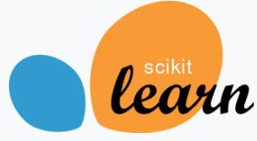

# what is pgml

there is 3 core driver in machine learning. They are data, algorithms, and computing resources. Now, the data are stored in data warehouse(Relation Database such as postgresql and oracle and etc ) or data lake(mainly hadoop hive) or cloud resource(google big query, amazone RDS/ s3 and etc).
Thought cloud service working well, if data privacy and security is your big concern. local storage and computing resource need be build. Apart from that, moving data between data warehouse/lake and computing resource remain a big bottleneck in common machine learning jobs.  Though there is madlib or other machine learning solution. There is space of solution of machine learning inside of database. 

pgml is postgresql machine learning tools. It combined the advantage of postgresql and machine learning power together by :

* install popular machine learning modules like sklearn, lightgbm, scipy, numpy, pandas and etc co-located with postgresql database(we call it as datawarehouse).

|||||

* computer the data insides of database by postgres UDF. it is write in plpython3( one server programm lanugage).

* utilizing DBT to get data module DDL/DML step easy, the data can be read inside postgresql and utilize the machine learning lib power.

 
* last but not least, all of above are built inside of docker image. It can easily move and revised at local or in the cloud.

# Getting_Start
Let's get pgml and get the python version by run sql inside of postgresql datawarehouse.
## requirements:

* centos/debian linux system with docker/docker-compose installed.
* windows10 system with docker desktop installed. 

## Steps:

1. git clone <the pgml git address>
2. change to the cloned folder it might be ./pgml
3. docker-compose up -d
4. docker-compose exec pgml psql -U postgres -c 'select get_python_version()' 

if every thing is smooth, the output will be 
> \# docker-compose exec pgml psql -U postgres -c 'select get_python_version()'
>
>            get_python_version
>
>            -----------------------------------------
>             3.7.3 (default, Jan 22 2021, 20:04:44) +
>
>              [GCC 8.3.0]
>
>              (1 row)

>
Congratualtion! The postgresql based machine learning datawarehouse has been ready for you using. 

# how to use the pgml tool

## By Manual (hard mode)
1. write postgresql UDF by plpython3u. Inside of UDF, you can write it like normal python script or functions. 
2. call the writed UDF in sql
3. get the result.

I used to manually mantenance the table, view and datas via using postgresql as machine learning warehouse. However, it is quite hard to change(DDL), read(DML) and test and quality control the code.

## DBT mode(easy mode)
### why DBT
In 2021, I was found there is ETL tools focused on data transformation called DBT. DBT is a data built tool which focused on data transformation with data lineage, test, and DAG. With DBT, You can still write SQL and gain quality control, documents and team work. DBT did not need data analyst to create table/view by DDL or DML. With DBT, you can easily do featuring engineering or make sure data quality and find data lineage.

- Easy feature engineering. Data Analysis can do feature engineering by write sql file. the file name will be stored in database warehouse as table or views based on the yml configurationi. 
- Automatic data lineage. If the sql statement 'select * from module ' is write as  'select * from {{ref('module')}}, the dbt will automatically find the data lineage. You can know the data source and data destination. 
- Rework easy. Not only feature engineering nor model cross validation is a work of exploratory. having one idea then try and test, another try again and again. With dbt run command, after finishing featuring engineering, you can run dbt run as folow to compile and execute these modules. The modoule will be created in postgresql database and the data will be created /or incrementally created. here is example:
- Quality in the control. DBT has provide test function. Data analyst can test the data module schema and data quality in many mode.
- Integrated development, you can use DBT + vscode IDE. VScode is a popular IDE. Both python, Sql, and DBT can work inside it. you can use python extension, dbt extension as well as git extension.
- Working remotely. With VScode remote explorer feature, the client, DBT and Postgres Database can work in 3 different servers or docker containers.  

# Example

## tiny data (below 100K rows)
Titanic. Machine learning from disaster. It is the classroom machine learning competition launched by Kaggle.  Thousands of data scientists joined the competition as the beginning of the Machine Learning.

Here is the original link: https://www.kaggle.com/c/titanic/data.  Kaggle provide the jupyter notebook IDE for competitors analyze data, feature engineering, train and predict. 
Why not use pgml +DBT ? Here is the link of PGML implementation:

## small data
TO DO

## medium data
TO DO

## large data 
TO DO

# Visualization
The feature engineering and cross validate result could be visualized by [superset](https://superset.apache.org/) 
I will consider add the feature in coming months.

# Advantage topic: optimization of postgres for machine learning jobs
If you want to process mediam to large volumn dataset for example(more than 100K), you can want to set postgres_ext.conf in you
postgresql.conf. By default, postgresql server only allocation 4MB memory for each of connection.

# Reference
## Machine Learning In database 
- Call python machine learning in Postgres (https://dba.stackexchange.com/questions/160620/call-python-machine-learning-model-from-udf-or-sp)

## DBT
- Learn more about dbt [in the docs](https://docs.getdbt.com/docs/introduction)
- Check out [Discourse](https://discourse.getdbt.com/) for commonly asked questions and answers
- Join the [chat](http://slack.getdbt.com/) on Slack for live discussions and support
- Find [dbt events](https://events.getdbt.com) near you
- Check out [the blog](https://blog.getdbt.com/) for the latest news on dbt's development and best practices

That's all!

If you like pgml, pls click like. Any idea is welcomed.

WangYong
2021-6-28

Another Machine Learning way 

Data Science by Data build tools & Postgres

The typical machine learning mode is pull data from datasource, and run it in jupyter or other similar IDE. It is popular but facing following challenge:
1. Gained data privacy concern : currently, machine learning need pull all(or big simple rate) data from data source. It should be big concern about data privacy. or leak data. as the regulation strict, the concern will be more and more for data owners.
2. limited featuring engineering colaboration:  to improve the trained model accuracy, feature engineering is important. it is dirty and hard work. Though kaggle has helped share brilliant feature engineering idea about many dataset. It is time to think how to let a group of people to work on feature engineering and assign work always.
3. hard to handle complex issue: based on the juputer notebook, a small data science case could be done smoothly. if the data is big and the case is complex, the jupyter notebook will be from hundres of line to thousand and more lines. Though the python or R code could be split into class or functions, the jupyter based data science project look hard to understand and handle those complex concern.
4. lack of testing: Before a data science case jupyter notebook ready, it may need many tests for data, functions and classes.  people can write test snippest inside jupyter notebook. soon or later, those snippest are difficult to find or manucipate. And data science has to run the test manually after found those  test snippest.
5. lack of module lineage and document:  Though luckly got the trained model with expect score, the juputer note book is difficult read and found how those model was trained and which feature engineering contributed to the best modules. Some data scientists manually write docuement or draw diagram to show them. It spent extra time and the module lineage might out of data afte module refined.
6. often memeory overload: when facing big data machin learning, the featuring engineering use memory, the data manucipate need manage, the traning need memory, after rounds of works, data scientist has to release memory for unused data setts. Those gabage collection are always difficult and lead to upset.

DBT based machine learning way could solve above problems:
1. data privacy concern :  the machine learning was converted to UDF(user defined function) inside the datawarehouse/lake. There is no need to pull data outside. Data scientist could use all data in the datawarehouse. The concers of data owner for 

2. limited featuring engineering colaboration:
3. hard to handle complex issue: 
4. lack of testing: 
5. lack of module lineage and document:
6. often memeory overload:

For small data, pull data from data 
This is a try to run Kaggle dataset machine learning inside Database and with DBT.

Database helps store and computer.
DBT helps to do version control, test and documentation.
Superset help to visualize the data & model in easy understand way.