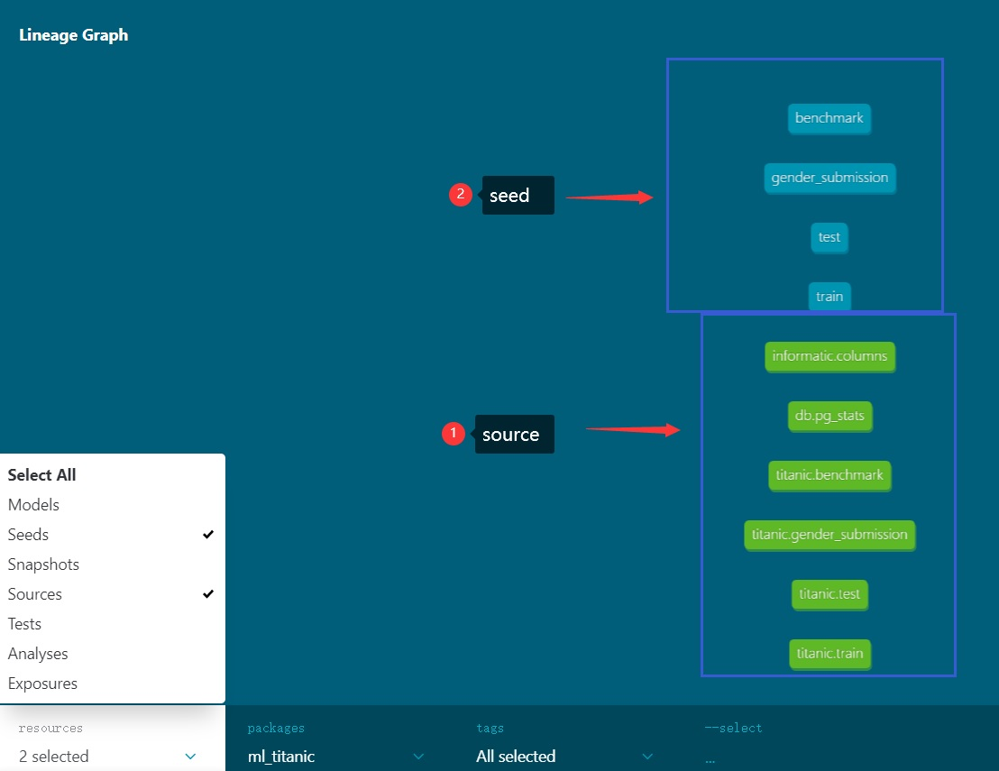
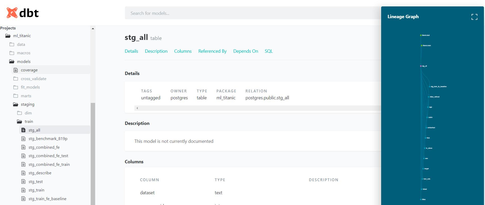

# Titanic - Machine learning from Disaster
It is the classroom machine learning competition launched by Kaggle.  Thousands of data scientists joined the competition as the beginning of the Machine Learning.

Original link: https://www.kaggle.com/c/titanic/data.  Kaggle provide the jupyter notebook IDE for competitors analyze data, feature engineering, train and predict. 

## Kaggle Machine learning resources:
1. [Titanic data science solution. The most voted code.](https://www.kaggle.com/startupsci/titanic-data-science-solutions)

## Why not use pgml + DBT ? 
DBT is one of the most popular data transforma tools. It help data analyst do ETL more easy and more efficently. pgml is a postgresql image with machine learning lib. 

## How to do it.
### 1. git pull pgml git@github.com:Wang-Yong2018/pgml.git
### 2. get the pgml ready as [pgml instruction](../../README.md#Getting_Start).
### 3. Prepare the PGML environment.
### 4. Prepare the project environment.
#### Key configurations:
- profiles.yml. This file will define the datawarehouse connection information. 

- dbt_project.yml. This file will connect profile.yml datawarehouse name and define the project folder position.
- run dbt deps. It will get dbt 3rd party extension from dbt hub.
- environment check by dbt config. If everything is OK, you can see following output:
#### Key steps
  - 1. create project database
    > [ pgml]# docker-compose exec pgml psql -U postgres -c 'create database titanic'
    > 
    > CREATE DATABASE

    when you see "CREATE DATABASE" prompt, it means the database has been created.

  - 2. add pgml profile
    
    put follow lines inside of the profiles.yml
    >     ml_titanic:
    >       target: dev
    >       outputs:
    >         dev:
    >           type: postgres
    >           host: pgml
    >           user: postgres
    >           password: postgres
    >           port: 5432
    >           dbname: titanic
    >           schema: public 
    >           threads: 3 
    >           # search_path: ['public']
    >           role: postgres
    >           # sslmode: []
    >     config: 
    >       send_anonymous_usage_stats: False

  - 3. create project 
  run dbt init command at pgml folder. here is example:
    >          [pgml]# docker-compose exec dbt dbt init titanic
    >          Running with dbt=0.19.1
    >          Creating dbt configuration folder at /root/.dbt
    >          With sample profiles.yml for redshift
    >          
    >          Your new dbt project "titanic" was created! If this is your first time
    >          using dbt, you'll need to set up your profiles.yml file (we've created a sample
    >          file for you to connect to redshift) -- this file will tell dbt how
    >          to connect to your database. You can find this file by running:
    >          
    >            xdg-open /root/.dbt
    >          
    >          For more information on how to configure the profiles.yml file,
    >          please consult the dbt documentation here:
    >          
    >            https://docs.getdbt.com/docs/configure-your-profile
    >          
    >          One more thing:
    >          
    >          Need help? Don't hesitate to reach out to us via GitHub issues or on Slack --
    >          There's a link to our Slack group in the GitHub Readme. Happy modeling!
    >          
    >          [pgml]# ls projects/titanic/
    >          analysis  data  dbt_project.yml  macros  models  README.md  snapshots  tests

             
      if everythin is OK. a folder will be created under projects folder.
      You clone pgml from github. the project folder has been created already. The results will be following message:

    >      [pgml]# docker-compose exec dbt dbt init titanic 
    >      Running with dbt=0.19.1
    >      Creating dbt configuration folder at /root/.dbt
    >      With sample profiles.yml for redshift
    >      Encountered an error:
    >      directory titanic already exists!

  - 4. revise project profile
    . revise the dbt_project.yml under projects\titanic. Change the profile configure to following: 
    >     # This setting configures which "profile" dbt uses for this project.
    >     profile: "ml_titanic"
  
  - 5. validate if project environment is ready
    note: PGML projects has been mapped to usr/app inside of the container. So we need use /usr/app/titanic as project folder. 
    >   [pgml]# docker-compose exec dbt dbt debug --project-dir /usr/app/titanic 
    >
    >   Running with dbt=0.19.1
    >
    >   dbt version: 0.19.1
    >
    >   python version: 3.8.8
    >
    >   python path: /usr/local/bin/python
    >
    >   os info: Linux-3.10.0-514.el7.x86_64-x86_64-with-glibc2.2.5
    >
    >   Using profiles.yml file at /root/.dbt/profiles.yml
    >
    >   Using dbt_project.yml file at /usr/app/titanic/dbt_project.yml
    >
    >   Configuration:
    >   
    >     profiles.yml file [OK found and valid]
    >   
    >     dbt_project.yml file [OK found and valid]
    >   
    >   Required dependencies:
    >    - git [OK found]
    >   
    >   Connection:
    >   
    >     host: pgml
    >   
    >     port: 5432
    >   
    >     user: postgres
    >   
    >     database: postgres
    >   
    >     schema: public
    >   
    >     search_path: None
    >   
    >     keepalives_idle: 0
    >   
    >     sslmode: None
    >   
    >     Connection test: OK connection ok
  When validate return OK for all checked items, the project of titanic is ready for your using now.

### 5. Build you model now          
1. Load data by run dbt seed. (put the original csv inside of project data folder. The dbt will automaticall import data into postgres datawarehouse). Below is example of load titanic train, test, kaggle benchmark csv .
>    	[ pgml]# docker-compose exec dbt dbt seed
>    	Running with dbt=0.19.1
>    	Found 40 models, 65 tests, 0 snapshots, 0 analyses, 157 macros, 2 operations, 4 seed files, 6 sources, 4 exposures
>    	08:19:18 | 2 of 4 OK loaded seed file public.gender_submission.................. [INSERT 418 in 0.46s]
>    	08:19:18 | 1 of 4 OK loaded seed file public.benchmark.......................... [INSERT 891 in 0.47s]
>    	08:19:18 | 3 of 4 OK loaded seed file public.test............................... [INSERT 418 in 0.47s]
>    	08:19:18 | 4 of 4 START seed file public.train.................................. [RUN]
>    	08:19:18 | 4 of 4 OK loaded seed file public.train.............................. [INSERT 891 in 0.21s]
>    	08:19:18 |
>    	08:19:18 | Finished running 4 seeds, 2 hooks in 0.90s.
>    
>    Completed successfully
>    
>    Done. PASS=4 WARN=0 ERROR=0 SKIP=0 TOTAL=4
seed imported and source generated.

   
2. feature engineering. Data Analysis can do feature engineering by write sql file. the file name will be stored in database warehouse as table or views based on the yml configurationi.  If the sql statement 'select * from module ' is write as  'select * from {{ref('module')}}, the dbt will automatically find the data lineage. know the data source and data destination. After finishing featuring engineering, you can run dbt run as folow to compile and execute these modules. The modoule will be created in postgresql database and the data will be created /or incrementally created. here is example:
   
>	[pgml]# docker-compose exec dbt dbt run
>	
>	Running with dbt=0.19.1
>	
>	Found 40 models, 65 tests, 0 snapshots, 0 analyses, 339 macros, 2 operations, 4 seed files, 6 sources, 4 exposures
>	
>	08:39:21 |
>	
>	08:39:21 | Running 2 on-run-start hooks
>	
>	08:39:21 | 1 of 2 START hook: ml_titanic.on-run-start.0......................... [RUN]
>	
>	08:39:21 | 1 of 2 OK hook: ml_titanic.on-run-start.0............................ [DO in 0.00s]
>	
>	08:39:21 | 2 of 2 START hook: ml_titanic.on-run-start.1......................... [RUN]
>	
>	08:39:21 | 2 of 2 OK hook: ml_titanic.on-run-start.1............................ [CREATE FUNCTION in 0.02s]
>	
>	08:39:21 | Concurrency: 3 threads (target='dev')
>	
>	08:39:21 |
>	
>	08:39:21 | 1 of 40 START table model public.stg_all............................. [RUN]
>	
>	08:39:21 | 2 of 40 START table model public.stg_benchmark_819p.................. [RUN]
>	
>	08:39:21 | 3 of 40 START table model public.stg_train........................... [RUN]
>	
>	08:39:22 | 1 of 40 OK created table model public.stg_all........................ [SELECT 1309 in 0.28s]
>	
>	08:39:22 | 4 of 40 START table model public.stg_train_test...................... [RUN]
>	
>	08:39:22 | 2 of 40 OK created table model public.stg_benchmark_819p............. [SELECT 891 in 0.28s]
>	
>	08:39:22 | 3 of 40 OK created table model public.stg_train...................... [SELECT 891 in 0.29s]
>	
>	08:39:24 | 31 of 40 OK created table model public.stg_combined_fe............... [SELECT 1309 in 0.14s]
>	
>	08:39:24 | 33 of 40 START incremental model public_models.ml_fe_baseline_title_refined [RUN]
>	
>	08:39:25 | 28 of 40 OK created incremental model public_models.ml_fe_baseline... [INSERT 0 2 in 1.80s]
>	
>	08:39:26 | 32 of 40 OK created incremental model public_models.ml_fe_baseline_sex [INSERT 0 2 in 1.72s]
>	
>	08:39:26 | 35 of 40 START table model public.stg_combined_fe_train.............. [RUN]
>	
>	08:39:26 | 35 of 40 OK created table model public.stg_combined_fe_train......... [SELECT 891 in 0.08s]
>	
>	08:39:26 | 36 of 40 START view model public_superset.get_corr................... [RUN]
>	
>	08:39:26 | 33 of 40 OK created incremental model public_models.ml_fe_baseline_title_refined [INSERT 0 2 in 1.74s]
>	
>	08:39:26 | 37 of 40 START table model public.stg_combined_fe_test............... [RUN]
>	
>	08:39:26 | 36 of 40 OK created view model public_superset.get_corr.............. [CREATE VIEW in 0.12s]
>	
>	08:39:26 | 38 of 40 START incremental model public_models.ml_fe_combined........ [RUN]
>	
>	08:39:26 | 37 of 40 OK created table model public.stg_combined_fe_test.......... [SELECT 418 in 0.12s]
>	
>	08:39:26 | 39 of 40 START view model public_superset.filtered_fe................ [RUN]
>	
>	08:39:26 | 39 of 40 OK created view model public_superset.filtered_fe........... [CREATE VIEW in 0.03s]
>	
>	08:39:27 | 34 of 40 OK created incremental model public_models.ml_fe_baseline_title [INSERT 0 2 in 1.74s]
>	
>	08:39:29 | 38 of 40 OK created incremental model public_models.ml_fe_combined... [SELECT 2 in 2.28s]
>	
>	08:39:29 | 40 of 40 START view model public_superset.viz_trained_results........ [RUN]
>	
>	08:39:29 | 40 of 40 OK created view model public_superset.viz_trained_results... [CREATE VIEW in 0.04s]
>	
>	08:39:29 |
>	
>	08:39:29 | Finished running 24 table models, 7 view models, 9 incremental models, 2 hooks in 7.57s.
>	
>	Completed successfully
>	
>	Done. PASS=40 WARN=0 ERROR=0 SKIP=0 TOTAL=40
From above screen capture, you may noticed that feature engineering has bee done and put into the public_fe schema.

3. cross validation
the machine learning can be run as sql. create UDF in macro folder and call the UDF in related modules. 
From above screen capture, you may noticed that cross validation  has bee done and put into the public_fe schema.

4. Documentation.
   After run 'dbt docs generate', you will be the html formated web resource which can show data module information and data lineage.

5. To be continuing...

That's all of titanic case. Enjoy it. Any feedback or issue is welcomed.

WangYong
2021-06-29