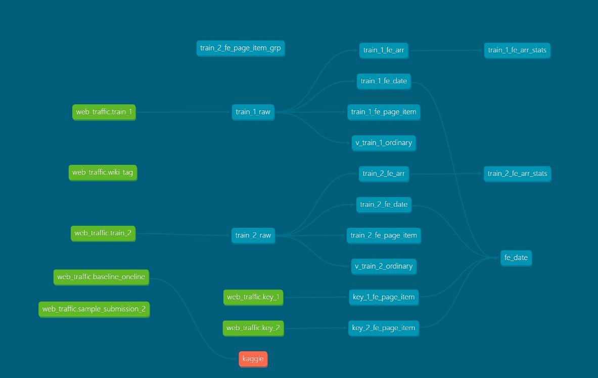

This is a study for using postgres + dbt to explore Kaggle [web_traffic](https://www.kaggle.com/c/web-traffic-time-series-forecasting) dataset

Dataset size: GB level
type: time series and forecase
Description: Using wiki page daily click to forecast future daily click.

Dataset DBT model up to now:

Try running the following commands:
- dbt run
- dbt test

The graph of inital EDA.

### Resources:
- Learn more about dbt [in the docs](https://docs.getdbt.com/docs/introduction)
- Learn more about postgres [in the docs](https://www.postgresql.org/docs/13/index.html)